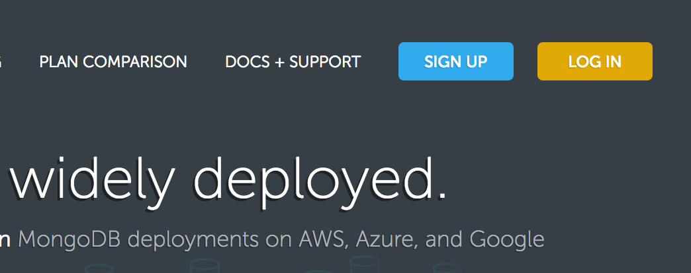
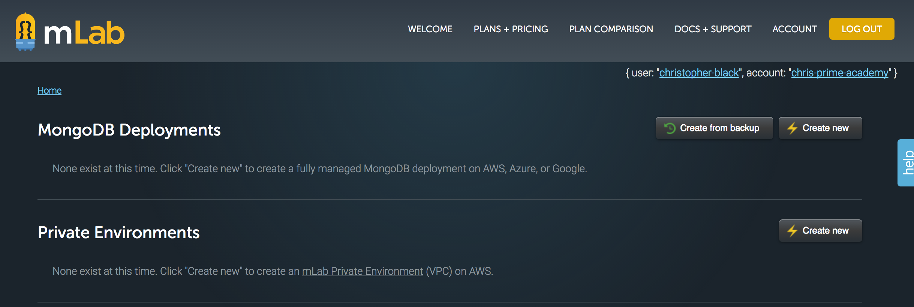
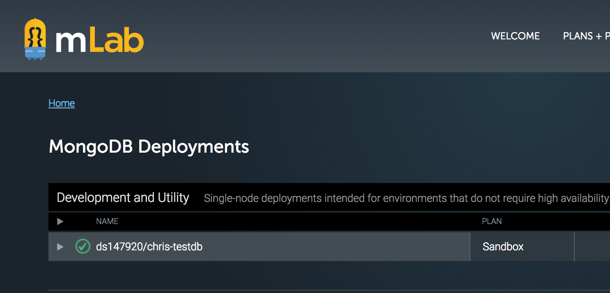
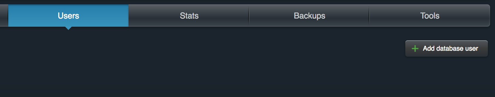

# Chi Heroku & mLab Lecture Notes

```
,________,         .------,          .------,    |    .------.
|________|       ,'_____,'|        ,'_____,'|    |   (        )
|        |       |      | |        | ____ | |    |   |~------~|
|        |       |      | |        | ____ | |    |   |~------~|
|        |       |      | ;        | ____ | ;    |   |~------~|
|________|       |______|'         |______|'     |   `.______.'
 HTML/CSS          CLIENT            SERVER      |    DATABASE
                                                 |
                   HEROKU                        |      mLab
```

### Heroku Setup

Hey Everyone! Just a quick walkthrough on getting setup for using Heroku.

First, we need to install the command line tools to use Heroku. So head over to terminal and enter this command:
```
brew install heroku
```

Great! This gives us to use Heroku in the command line. Let's verify that that installed OK. We can do that by checking the version of Heroku on our computer. Enter this command:
```
heroku --version
```

The hope is that you see something like this as a response: `heroku-cli/5.6.0-010a227 (darwin-amd64) go1.7.4`
If not, touch base with an Instructor to help see what might be going on.

To proceed, you are going to need an account with Heroku. Head over to https://www.heroku.com/, and create a User. You will need to note your username and password as you will need to sign in via the command line with that same account.

After you create an account, head back over to the Terminal and enter this command:
```
heroku login
```

Enter in your User Name and Password. Note that this will not show up in the command line as you type. So you will be typing, but it may look like you are not typing anything (but you are, don't worry).

That's it! You are ready for lecture!

### Add Project to Heroku

`git init` is only required if your project isn't already a git repository.

```
git init
git add .
git commit -m "Initial commit."
heroku create
git push heroku master
heroku open
```

If you have a page that says **Application Error**, check you code by running a server locally

`heroku logs`

- Don't test on Heroku, deploy fully tested code to Heroku.
- Once everything is set up, you will only need to
  - `git add .`
  - `git commit -m "YOUR COMMIT"`
  - `git push heroku master` when you're ready to deploy

### mLab Setup

1. Sign up [here](https://mlab.com)
  
2. Create new MongoDB deployment
  
3. Select a Cloud Provider
  - Single-node **Sandbox**
  - Database name (must be unique): e.g. scottb-testdb
  - Create new deployment
4. Click on the database that you created
  
5. Click on the Users tab
  - Add database user
  
  - Copy the URI for you db `mongodb://<dbuser>:<dbpassword>@...`
6. Paste the URI into your project and replace the dbuser & dbpassword
